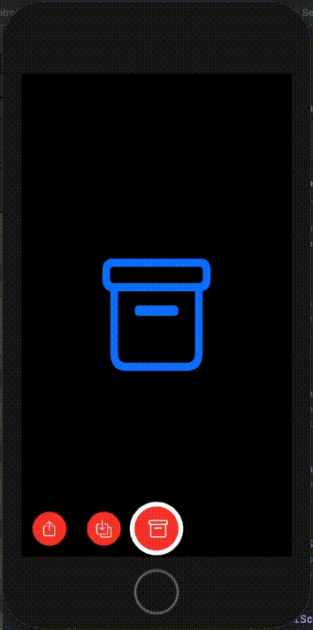

# Snapchat image selector mock

This project's purpose is to create a mock of the Snapchat image selector.

## Features 

- Select image

## Requirements

- iOS 14.1+
- Swift 5.0+
- Swift packages: UtilityKit 1.0.1

#### Swift Package Manager

- File > Swift Packages > Add Package Dependency
- Add `https://github.com/darrylweimers/UtilityKit`
- Select "Up to Next Major" with "1.0.1"

## Credits

- Darryl Weimers
